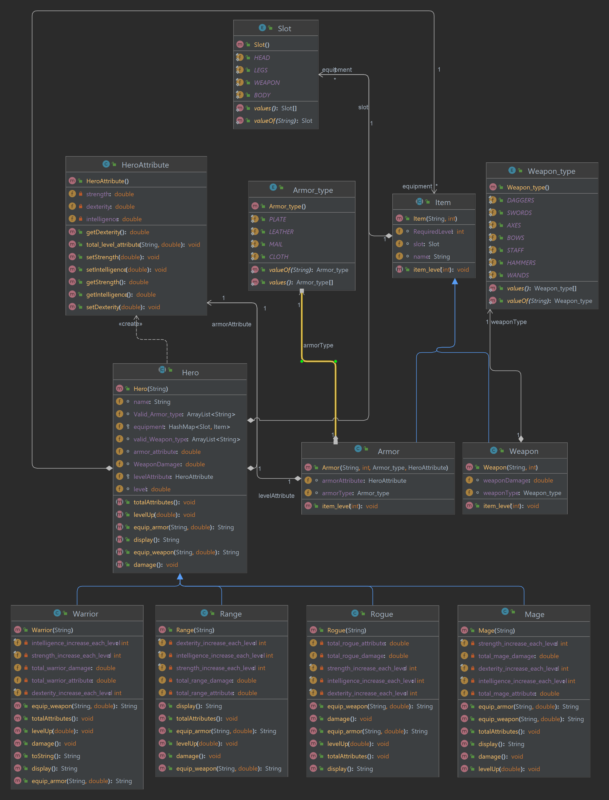

# RPG Heroes

Console app for creating heroes character and their Equipment.
The equipment will increase the state of the heroes.
Heroes can use certain equipment  similar to their character example staff for mage and sword for Warrior.

## Setup

Every hero start at level 1 and initial hero attribute example:

| hero    | Strength | Dexterity | Intelligence |
|---------|---|---|---|
 | Mage    | 1 | 1 | 8 |
| Range   | 1 | 7 | 1 |
| Rogue   | 2 | 6 | 1 |
| Warrior | 5 | 2 | 1 |

## Classes

The Console app will contain following character:

* Test_Hero Abstract class

* Contains the heroes name and characteristic

  * Mage class extends from Character class 
  * Ranger class extends from Character class
  * Rogue class extends from Character class
  * Warrior class extends from Character class

* Test_Hero Attributes class
  * Contains a hashmap of heroes statics 

* Items abstract class
  * Weapons
  * Armor

## Class diagram

* Every Test_Hero type will extend several Method from the Test_Hero class

  * LevelUp: increase the level of the hero
  * Damage: is the damage a hero deals 
  * equip_armor: method to equip the armor of the hero
  * equip_weapon: method to equip a weapon to the hero
  * totalAttribtues: the total level of the hero including the heroes stats
  * display: the total state of the hero including their name and class
  

